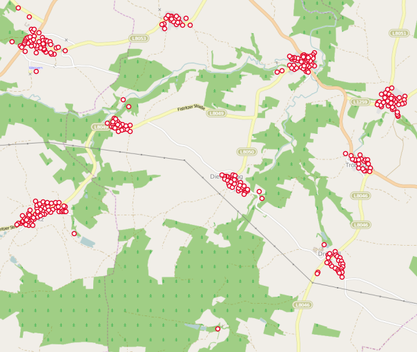

Looking for the same thing, but in Python?
Look no further: https://github.com/scubbx/convert-bev-address-data-python

------

Austrian Bundesamt für Eich- und Vermessungswesen (BEV) has made the Austrian Address Register freely available:

* Data: http://www.bev.gv.at/portal/page?_pageid=713,1604469&_dad=portal&_schema=PORTAL
* TOS: http://www.bev.gv.at/portal/page?_pageid=713,2573888&_dad=portal&_schema=PORTAL

However, the main file (`ADRESSE.csv`) contains three coordinate systems ([EPSG:31254 (Austria GK West)](http://spatialreference.org/ref/epsg/31254/), [EPSG:31255 (Austria GK Central)](http://spatialreference.org/ref/epsg/31255/), [EPSG:31256 (Austria GK East)](http://spatialreference.org/ref/epsg/31256/)) and is too big to be converted to a shapefile directly.

This tool (Windows only) strips all attributes and creates a CSV with [EPSG:31287 (MGI / Austria Lambert)](http://spatialreference.org/ref/epsg/31287/) coordinates.


## Download

Binaries: https://github.com/BergWerkGIS/convert-bev-address-data/releases


## Usage

```
      convert-bev-address-data -i <PATH-TO-BEV-DATA-DIRECTORY> [-o] [-e] [-d]

options:
  -i, --input=VALUE          diretory containing extracted CSVs
  -o, --output=VALUE         output file, optional (default: out.csv)
  -e, --epsg=VALUE           target epsg code, optional (default: 31287)
  -d, --decimals=VALUE       decimal places, optional (default: 6)
                               depending on the chosen output crs it makes
                               sense to limit the number of decimal places.
                               e.g. 6 decimal places don't make sense for crs
                               with [m] units.
                               But it makes sense to have 6 decimal places with
                               EPSG:4326.
  -u, --usage                show this message and exit
```





## Source

Visual Studio 2015 is needed to compile the source
